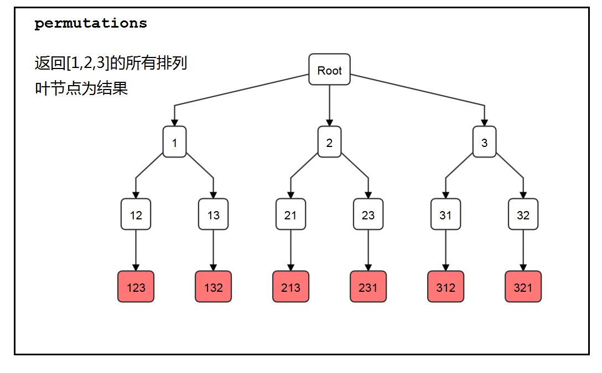

# 回溯算法

## 回溯算法本质
决策树的遍历过程，考虑：
1. 路径：已做出的选择
2. 选择列表：也就是你当前可以做的选择
3. 结束条件

## 回溯算法与DFS 的区别

回溯法在求解过程中不保留完整的树结构，而DFS记录完整的搜索树

## code template

```Python
result = []
def backtrack(路径，选择列表)：
    if(满足结束条件)：
        result.append(路径)
        return
    for 选择 in 选择列表：
        做选择
        backtrack(路径，选择列表)
        撤销选择
```

### 例题 - 全排列问题
**全排列问题** - N 个不重复的数的全排列共有n！个

**例： 求 [1, 2, 3] 的全排列。**

-> 通过决策树

          first 1 ...
     1  / 
       /   2
    start --- first 2 ...         
       \
      3 \
         first 3 ...

Start:
- 选择：[1,2,3]
- 路径： [ ]

first 1:
- 选择：[2,3]
- 路径：[1]

将问题转化为决策树后, 问题等同于遍历一棵树，当走到树的底层后，其路径为一个全排列。 此时：
 - 前序遍历  -> 进入节点前执行
 - 后序遍历 -> 进入节点后执行

## 问题归类

### subset 问题

1. **给出一个不含重复元素的数组，返回它的所有子集**
2. **给出一个含有重复元素的数组，返回它的所有子集，不准重复**


[1,2,3,4]中有四个元素，其子集可以有0-4个元素。设计树的每一个节点为一个子集，根为空集。在根的基础上加一个元素，就成为了有1个元素的子集，那么根有4个选项。在第一层的节点基础上再增加一个元素，就成为了有2个元素的子集，以此类推，直至第四层。

那么，第一层一定有4个选项，分别为1，2，3，4。从1向下，即在1的基础上增加元素，则有12，13，14。从2向下，为了避免重复，只允许选择2之后的元素，则有23和24，以此类推

#### code - subset
```Python
class Solution:
    res = []
    def subsets(self, nums: List[int]) -> List[List[int]]:
        self.res = []
        currentList = []
        self.backtracking(0,nums,currentList)
        return self.res

    def backtracking(self,start,nums,currentList):
        self.res.append(currentList.copy())

        for i in range(start,len(nums)):
            currentList.append(nums[i])
            self.backtracking(i+1,nums,currentList)
            currentList.pop()
```

#### code - Subsets II

```python
class Solution:
    res = []
    def subsetsWithDup(self, nums: List[int]) -> List[List[int]]:
        self.res = []
        currentList = []
        nums.sort()
        self.backtracking(nums,0,currentList)
        return self.res
    
    def backtracking(self,nums,start,currentList):
        self.res.append(currentList.copy())
        i = start
        while i < len(nums):
            currentList.append(nums[i])
            self.backtracking(nums,i+1,currentList)
            currentList.pop()
            while i + 1 < len(nums) and nums[i] == nums[i+1]:
                i +=1
            i += 1
```

### permutation问题
1. **给出一个不含重复元素的数组，返回它的所有排列；**
2. **给出一个含有重复元素的数组，返回它的所有排列，不准重复；**

在这个决策树中，所有叶节点为想要找寻的结果。

#### code- permutation
```python
class Solution:
    res = []
    def permute(self, nums: List[int]) -> List[List[int]]:
        self.res = []
        currentList = []
        self.backtracking(nums,currentList)
        return self.res

    def backtracking(self,nums,currentList):
        if len(currentList) == len(nums):
            self.res.append(currentList.copy())
            return
        for i in range(len(nums)):
            if nums[i] not in currentList:
                currentList.append(nums[i])
                self.backtracking(nums,currentList)
                currentList.pop()
```

#### code - 
```python
class Solution:
    res = []
    def permuteUnique(self, nums: List[int]) -> List[List[int]]:
        self.res = []
        currentList = []
        nums.sort()
        used = []

        for i in range(len(nums)):
            used.append(False)
        
        self.backtracking(nums,currentList,used)
        return self.res
    
    def backtracking(self,nums,currentList,used):
        if len(currentList) == len(nums):
            self.res.append(currentList.copy())
            return
        i = 0
        while i < len(nums):
            if used[i]:
                i +=1
                continue
            else:
                currentList.append(nums[i])
                used[i] = True
                self.backtracking(nums,currentList,used)
                currentList.pop()
                used[i] = False
                while i + 1 < len(nums) and nums[i] == nums[i+1]:
                    i += 1
                i +=1
```

### combination sum 问题
性质与subset相同。在树的每一层增量选择一个元素构成答案的一部分。不同的是，由于有sum == target这个要求，在枚举过程中需要作出选择，抛弃不符合要求的选项。


1. **给出一个整数数组及整数target，返回和为target的所有组合，每个元素可以使用无穷多次；** 
2. **给出一个整数数组及整数target，返回和为target的所有组合，每个元素只能使用一次；**

####code - combination sum
```python
class Solution:
    res = []
    def combinationSum(self, candidates: List[int], target: int) -> List[List[int]]:
        self.res = []
        currentList = []
        candidates.sort()
        self.helper(candidates,target,0,currentList)
        return self.res
    
    def helper(self,candidates, target, start,currentList):
        if target == 0:
            self.res.append(currentList.copy())
            return
        for i in range(start,len(candidates)):
            if candidates[i] > target:
                return
            currentList.append(candidates[i])
            self.helper(candidates, target-candidates[i], i,currentList)
            currentList.pop(len(currentList)-1)
```

#### code - Combination Sum II
```python
class Solution:
    res = []
    def combinationSum2(self, candidates: List[int], target: int) -> List[List[int]]:
        self.res = []
        candidates.sort()
        currentList = []
        self.backtracking(candidates, target, 0, currentList)
        return self.res
    
    def backtracking(self,candidates,target,start,currentList):
        if target == 0:
            self.res.append(currentList.copy())
            return
        
        i = start
        while i < len(candidates):
            if candidates[i] > target:
                return
            currentList.append(candidates[i])
            self.backtracking(candidates,target-candidates[i],i+1,currentList)
            currentList.pop()
            while i + 1 < len(candidates) and candidates[i] == candidates[i+1]:
                i +=1
            i+=1
```