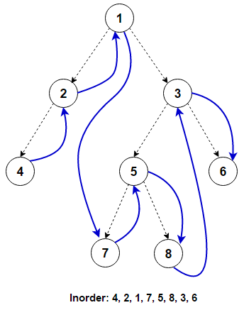

# Traversal of binary tree

# Preorder
```
class Solution:
    def preorderTraversal(self, root: Optional[TreeNode]) -> List[int]:
        if root is None:
            return None
        
        res = []
        res = self.preorderhelper(root,res)
        return res
    
    def preorderhelper(self,root,res):
        if root is None:
            return None
        res.append(root.val)
        self.preorderhelper(root.left,res)
        self.preorderhelper(root.right,res)
        return res
```


# Inorder


```
# Definition for a binary tree node.
# class TreeNode:
#     def __init__(self, val=0, left=None, right=None):
#         self.val = val
#         self.left = left
#         self.right = right
class Solution:
    def inorderTraversal(self, root: Optional[TreeNode]) -> List[int]:
        if root is None:
            return None
        res = []
        res = self.inOrderHelper(root,res)
        return res
    
    def inOrderHelper(self,root,res):
        if root is None:
            return None
        
        self.inOrderHelper(root.left,res)
        res.append(root.val)
        self.inOrderHelper(root.right,res)
        return res

```

# postorder

```
# Definition for a binary tree node.
# class TreeNode:
#     def __init__(self, val=0, left=None, right=None):
#         self.val = val
#         self.left = left
#         self.right = right
class Solution:
    def postorderTraversal(self, root: Optional[TreeNode]) -> List[int]:
        if root is None:
            return None
        res = []
        res = self.postorderHelper(root,res)
        return res
    
    def postorderHelper(self,root,res):
        if root is None:
            return None
        self.postorderHelper(root.left,res)
        self.postorderHelper(root.right,res)
        res.append(root.val)
        return res
        


```
