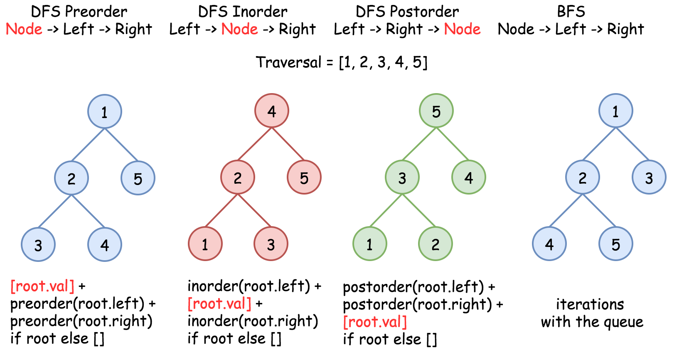
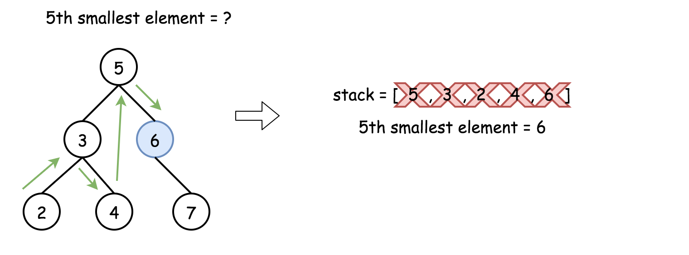

# question


 ```
 class Solution:
    def kthSmallest(self, root: Optional[TreeNode], k: int) -> int:
        stack = []
        current = root

        while current or stack:
            while current:
                stack.append(current)
                current = current.left
            current = stack.pop()
            k -=1
            if k ==0:
                return current.val
            current = current.right
```

**Time complexity: O(H + k)**

where H is a tree height. This complexity is defined by the stack, which contains at least H+k elements, since before starting to pop out one has to go down to a leaf. 