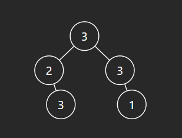

# question

The thief has found himself a new place for his thievery again. There is only one entrance to this area, called root.

Besides the root, each house has one and only one parent house. After a tour, the smart thief realized that all houses in this place form a binary tree. It will automatically contact the police if two directly-linked houses were broken into on the same night.

Given the root of the binary tree, return the maximum amount of money the thief can rob without alerting the police.
 ```Python
class Solution:
    def rob(self, root: Optional[TreeNode]) -> int:
        res = self.helper(root)
        return max(res[0],res[1])

    def helper(self,root):
        if root is None:
            return [0,0]
        
        left = self.helper(root.left)
        right = self.helper(root.right)
        # if rob currentNode, money = root.val + notrobleft + notrobright
        isRob = root.val + left[1] + right[1]
        notRob = max(left[0],left[1]) + max(right[0],right[1])
        return [isRob,notRob]
```




- at each position, we need to choose to rob the current node or not, and store it in array with format [rob,notrob]
- if rob, the money would be currentnode.val + notrobleft + notrobright
- if not rob, we want to see which situation could collect more money: rob the child node or not.  