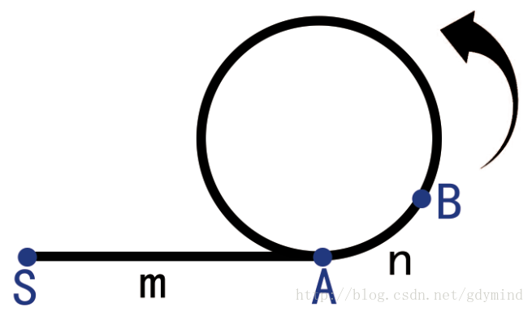

龟兔赛跑
假设起点为S

从起点到环入口A点的距离为m,环长度为L

乌龟每次前进一步，兔子每次前进两步，在环中相遇于B点。

乌龟路程：D =  m+n+aL (1)

兔子路程：2D = m+n+bL (2)

由（2）-（1）可得：
D = (b-a)L (3)

由（1）= （3）可得：
m+n = (b-2a)L

说明m+n为L的整数倍

此时将乌龟放回S点，乌龟与兔子同速，每次一步

当乌龟到达环起点A时，步行距离为： m

而兔子步行距离为：m,且相对于环起点的距离为： n+m,即环的整数倍

则推理得：兔子将回到A点，与乌龟相遇。


```
```

